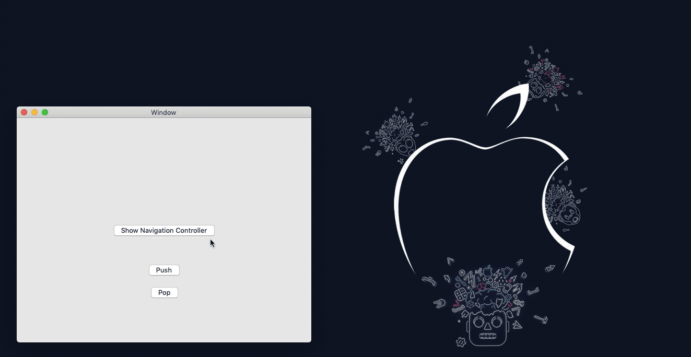

# CocoaNavigationController

         

UINavigationController alike, macOS





### How to use

``` Swift
    let navigationController = CocoaNavigationController(withFrame: NSApp.keyWindow!.frame, rootViewController: nil)
    let window = NSWindow(contentViewController: self.navigationController!)
    window.makeKeyAndOrderFront(nil)


    // Push
    let vc = TestViewController(nibName: "TestViewController", bundle: nil)
    navigationController.pushViewController(vc, animated: true)

    // Pop
    navigationController?.popViewController(vc, animated: true)
```


### Under the hood

Actually, we just transition between two subview, contained by root view.

Arrange the two subview horizontally. Then slide the whole one from right to left for push, pop with opposite direction.


``` Swift

                        Push
     ◀─ ─ ─ ─ ─ ─ ─ ─ ─ ─ ─ ─ ─ ─ ─ ─ ─ ─ ─ ─
     ┌ ─ ─ ─ ─ ─ ─ ─ ─ ─ ┐ ┌ ─ ─ ─ ─ ─ ─ ─ ─ ─ ┐
     
     │                   │ │                   │
     
     │                   │ │                   │
     
     │       From        │ │        To         │
     
     │                   │ │                   │
     
     │                   │ │                   │
     
     └ ─ ─ ─ ─ ─ ─ ─ ─ ─ ┘ └ ─ ─ ─ ─ ─ ─ ─ ─ ─ ┘
     ─ ─ ─ ─ ─ ─ ─ ─ ─ ─ ─ ─ ─ ─ ─ ─ ─ ─ ─ ▶
                        Pop
                        
```

For transition fluently, we snapshot from-view and to-view as placeholders, which hide all the remove/add actions.

And, like `drawViewHierarchyInRect:afterScreenUpdates` in iOS, NSView support similar method like below:

``` Swift
extension NSView {
    func snapshot() -> NSImage? {
        // Returns a bitmap-representation object suitable for caching the specified portion of the view.
        guard let bitmapRep = bitmapImageRepForCachingDisplay(in: bounds) else { return nil }
        cacheDisplay(in: bounds, to: bitmapRep)
        let image = NSImage()
        image.addRepresentation(bitmapRep)
        bitmapRep.size = bounds.size
        return image
    }
}
```